# Amazon_Vine_Analysis
Analyzing Amazon reviews written by members of the paid Amazon Vine program.

## Overview of the analysis:

 This project is for analyzing Amazon reviews written by members of the paid Amazon Vine program. The Amazon Vine program is a service that allows manufacturers and publishers to receive reviews for their products. Companies like SellBy pay a small fee to Amazon and provide products to Amazon Vine members, who are then required to publish a review.

 ## Tools used :
 Using the knowledge of the cloud ETL process, we've created an AWS RDS database with tables in pgAdmin, picked a dataset from the Amazon Review datasets (Links to an external site.), and extract the dataset into a DataFrame. Then transformed the DataFrame into four separate DataFrames that match the table schema in pgAdmin. Then, uploaded the transformed data into the appropriate tables and ran queries in pgAdmin to confirm that the data has been uploaded.

## Results: 
Deliverable 1: Perform ETL on Amazon Product Reviews

### Amazon_Reviews_ETL
1.  The Amazon Review dataset is extracted as a DataFrame. We used the video games reviews url for this analysis.
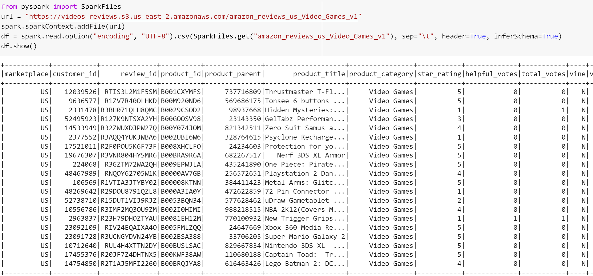

2.  The extracted data is converted into a dataframe. We cleaned the dataframe by dropping null values.
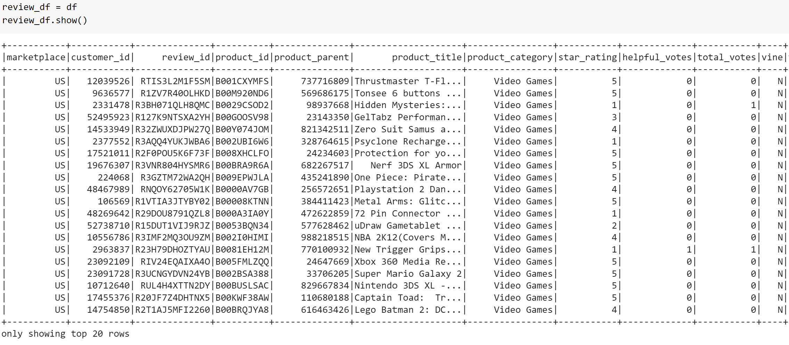   

3. The extracted dataset is transformed into four DataFrames with the correct columns.
a. The customers_df DataFrame
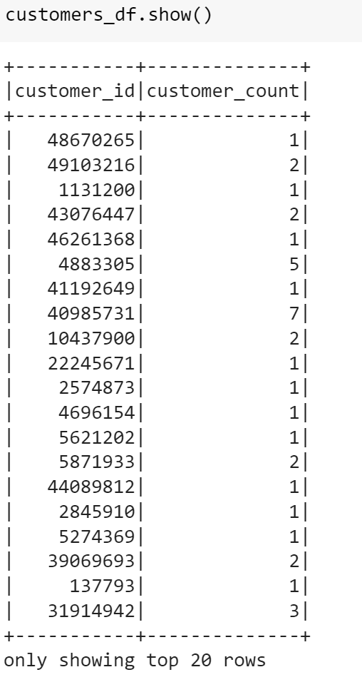

b. The products_df DataFrame

c. The review_id_df DataFrame
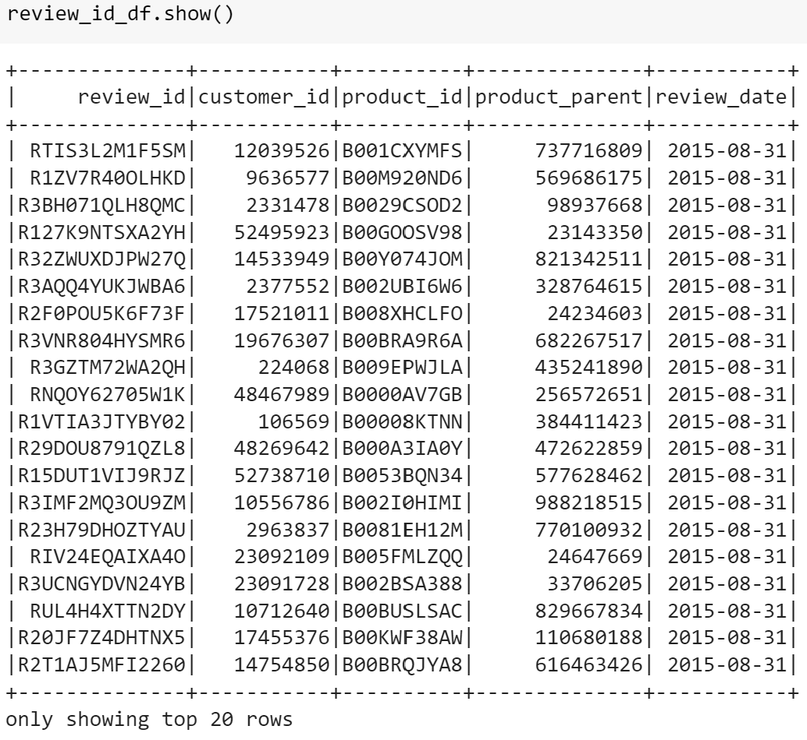

d. The vine_df DataFrame
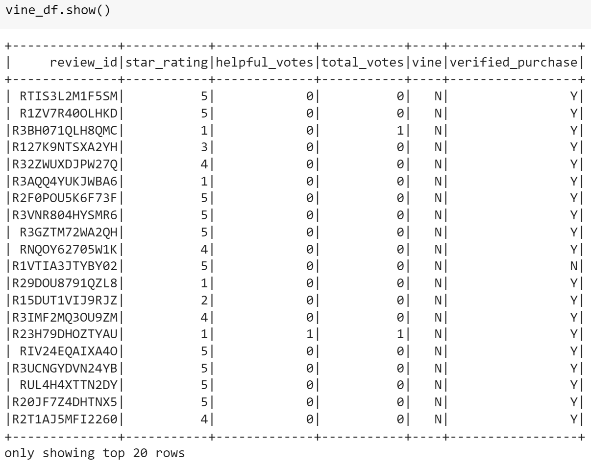

4. All four DataFrames are loaded into their respective tables in pgAdmin
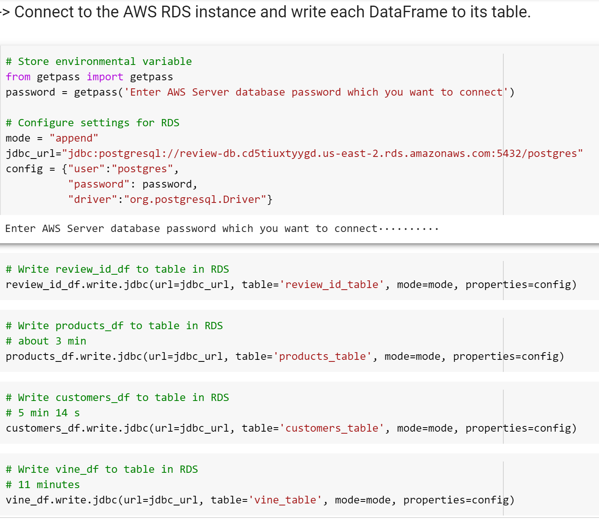

All the tables as displayed in postgreSql :
a. The customers_table DataFrame
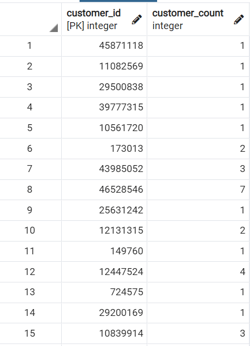

b. The products_table DataFrame
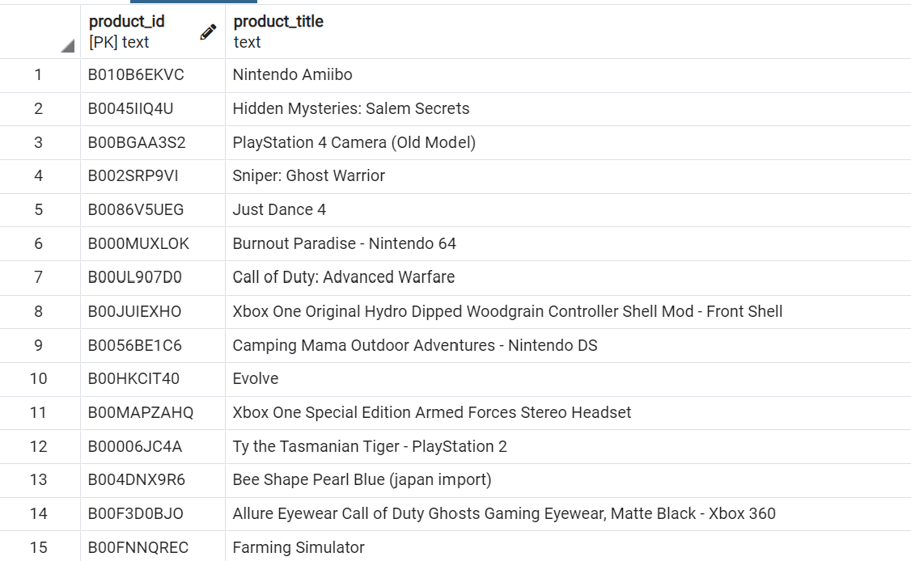

c. The review_id_table DataFrame
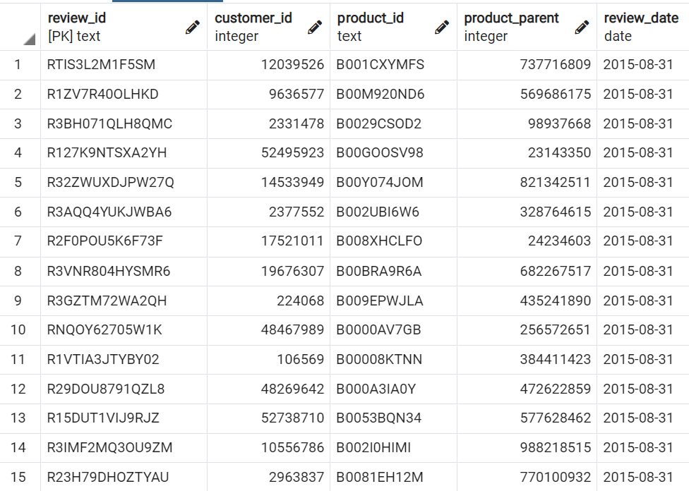

d. The vine_table DataFrame
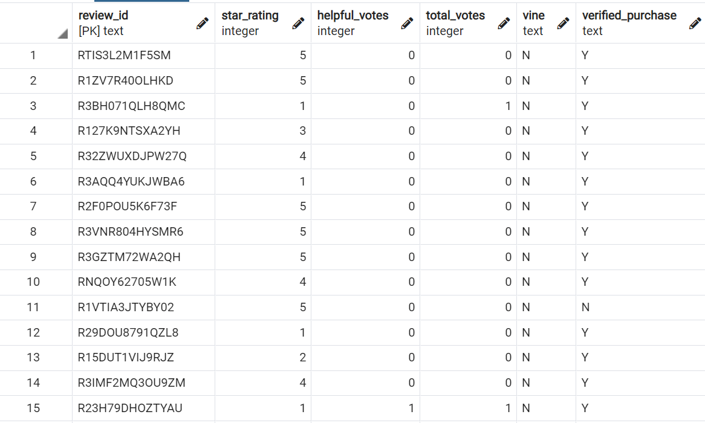

## Deliverable 2: Determine Bias of Vine Reviews
### Results :
1.  In order to do the analysis on the reviews that are more likely to be helpful, we filtered the dataframe for total reviews above 20 and for the helpful reviews greater than 50% from the total reviews.

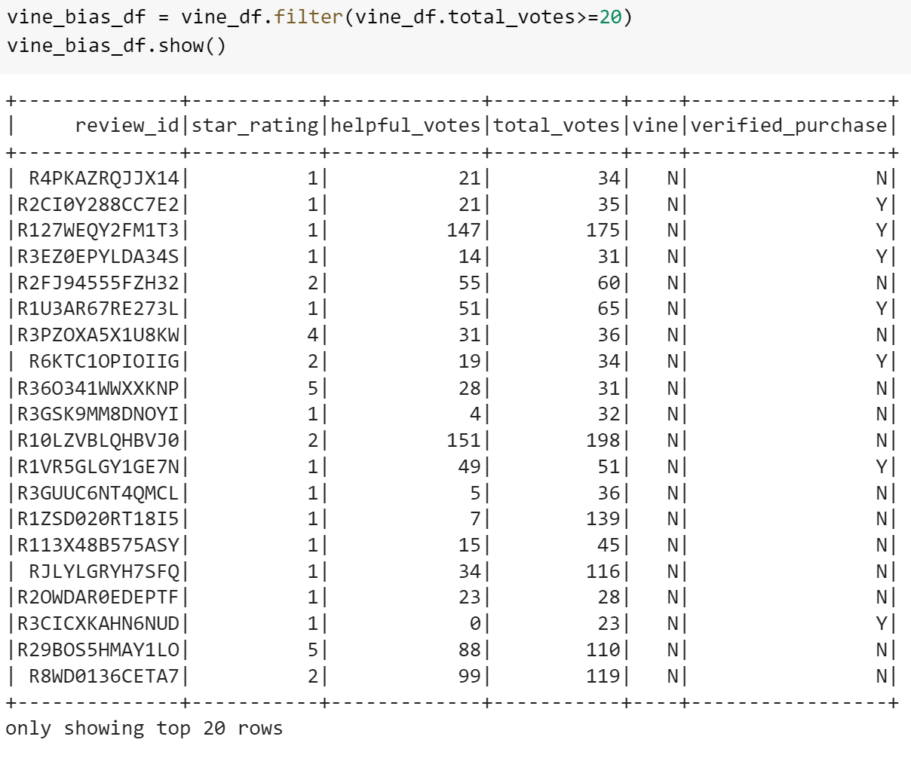

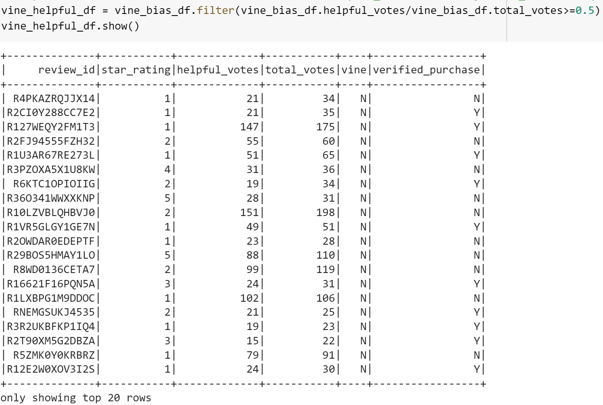

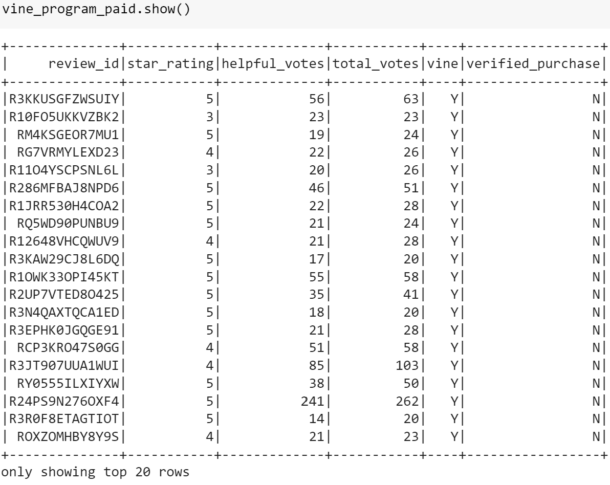

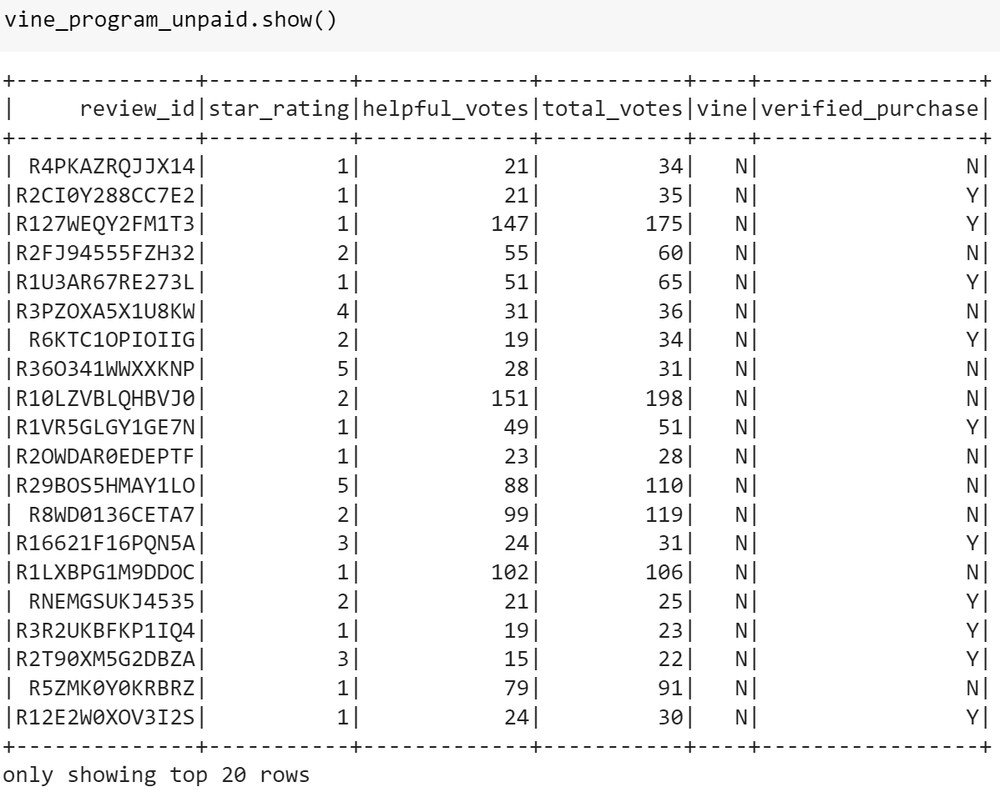

2.  Following questions were answered from the above analysis : 

How many Vine reviews and non-Vine reviews were there?
Total Vine reviews for all reviews in which the total votes were above 20 and helpful votes were >=50%) including all stars are 94.

Total non-Vine reviews for all reviews in which the total votes were above 20 and helpful votes were >=50%) including all stars are 40471.

How many Vine reviews were 5 stars? How many non-Vine reviews were 5 stars?
The total number of 5 star reviews for all vine reviews above 20 and greater than 50% is 15711.

The total number of 5 star reviews for paid vine reviews above 20 and greater than 50% is 48.

The total number of 5 star reviews for unpaid vine reviews above 20 and greater than 50% is 15663.

What percentage of Vine reviews were 5 stars? What percentage of non-Vine reviews were 5 stars?

The percentage of the paid 5 star vine reviews out of the total helpful reviews is 51%.

The percentage of the unpaid 5 star vine reviews out of the total reviews is 38.7%.

## Summary: 

As per the calculations above, we were able to identify that the paid 5 star reviews is 51% which proves that there is positivity bias for reviews in the Vine program. 

### Additional analysis :
Also, we did an additional analysis to understand how many of the paid reviews and unpaid reviews were verified purchases. we found following results :

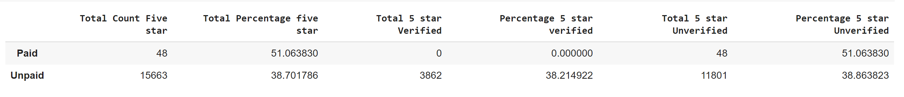

1. Out of the total 48 paid 5 star vine reviews, none of those were verified purchases.

2. Out of the total 15,663 unpaid 5 star vine reviews, 3862 reviews were only of verified purchases, 11801 reviews were from non verified purchases.

This proves that there is positivity bias for the reviews in the vine program.
   

